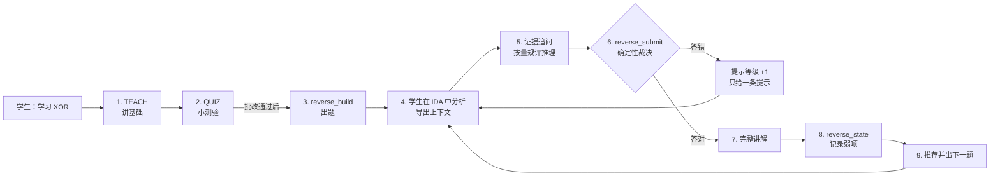
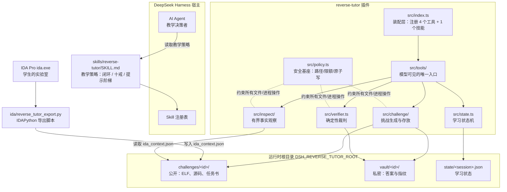

# Reverse Tutor — DeepSeek Harness 逆向工程教练（IDA Pro 版）

[](LICENSE)
[](https://nodejs.org)
[](https://github.com/deepseek-ai/deepseek-harness)

> English documentation: [README.en.md](README.en.md)

一个运行在 [DeepSeek Harness](https://github.com/deepseek-ai/deepseek-harness) 上的 AI 逆向工程教练插件：学生给一个主题，插件生成一个真实的 32 位 ELF crackme，学生在 IDA Pro 里分析，导师只给分层提示，最终答案由一个**确定性验证器**裁决——永远不让模型说了算。

```
主题 → 教学目标 → 生成 ELF crackme → IDA Pro 分析 → 证据追问
     → 分层提示 → 验证答案 → 完整讲解 → 按弱点追踪推荐下一题
```

**仓库地址**：<https://github.com/Jack-infinity420/reverse-tutor>

## 特性

- **真实靶子**：五个主题（XOR / strcmp / 算术 / 分支 / 调用约定）× 两档难度，共十个模板变体，每个都是真实可运行的 ELF32 i386 可执行文件
- **答案不在交付物里**：源码和二进制只含编码后的参考数据，`strings` 和 `.rodata` dump 给学生的是密文，反推才是练习（测试强制保证）
- **确定性裁判**：能跑 ELF 的宿主上真实执行二进制读退出码；不能跑则用模板谓词兜底，两档结论一致性由测试断言——两条路都不经过模型
- **分层提示阶梯**：六级提示，答错一次才升一级，Agent 自己无权升降
- **弱点追踪**：五项技能分 + 弱点记录驱动下一题推荐
- **零运行时依赖**：只用 Node 内建模块，profile 安装永远不会因缺传递依赖而失败

---

## 快速开始

### 环境要求

- Node **20.11+**（运行时零依赖）
- 一个能产出 32 位 Linux i386 ELF 的编译器：优先 `clang` + `lld`，任何支持 i386 Linux 目标的 `gcc` 也行。Windows 上 clang/lld 即可，因为挑战是 **freestanding**（无 libc、无头文件、纯 `int 0x80` 系统调用）
- 可选：`qemu-user`（`qemu-i386`）或 WSL——装上后 `reverse_submit` 会真实执行二进制来裁决，否则用模板谓词兜底（结论一致，见下文「验证分档」）
- 可选：IDA Pro + IDAPython（学生侧）

### 安装

```sh
git clone https://github.com/Jack-infinity420/reverse-tutor.git
cd reverse-tutor
npm install && npm run build

# 装进 DSH profile
dsh plugin --profile <你的-profile> add "file:/绝对路径/reverse-tutor"
```

安装会应用 `cordis.patch.yml`，把插件挂进该 profile 的宿主组合。**重启 profile** 后工具列表生效。验证：

```sh
dsh --profile <你的-profile> --dump-config | grep reverse-tutor
```

不装 profile 也可以直接用 CLI 验货：

```sh
node lib/cli.js info        # 产物根目录、编译器、运行时情况
node lib/cli.js selftest    # 构建并自测全部十个模板变体
```

### 上第一节课

在 DSH 对话里说一句：

```
学习 XOR
```

Agent 会加载教学策略、调用 `reverse_build`，把二进制路径交给你。在 IDA Pro 里打开它（镜像基址 `0x08048000`、`.text` 起于 `0x08049000`，师生谈论的是同一份地址），把光标放进想讨论的函数，运行导出脚本 `ida/reverse_tutor_export.py`（或在 IDA Python 控制台 `exec(open(r"<package>/ida/reverse_tutor_export.py").read())`），说一句"导出了"——导师接下来的问题就会对着你屏幕上那个函数问。

---

## 工作流程：学生说一句"学习 XOR"之后会发生什么



**第一步 · 定主题（TOPIC）。** 导师用一句话复述主题，确认今天要学什么。不问你"基础怎么样"——前置知识由下一步直接教。

**第二步 · 讲基础（TEACH）。** 一屏以内的篇幅，讲这个主题的 3–5 个二进制层面的事实，每条都表述成"你待会儿会在 IDA 里看到的形态"：一种指令形状、一个数据结构、一种调用模式。不讲泛泛的语言语义，不剧透即将生成的二进制。

**第三步 · 小测验（QUIZ）。** 3–4 道选择题（A–D），只考刚讲过的事实，不涉及即将生成的二进制。你回字母，导师逐题批改，错的一行纠正。**全对是出 intermediate 难度的理由，错两题以上出 beginner。** 测验没批改完不会出题。

**第四步 · 出题（CHALLENGE）。** 导师调用 `reverse_build`：选模板 → 生成秘密答案 → 只把**编码后的参考字节**注入 C 源码 → 编译成 ELF32 i386 crackme → 自测 → 答案锁进 vault。你拿到的只有二进制路径、答案长度和任务书——导师从头到尾也没见过答案。

**第五步 · 你在 IDA 里分析（STUDENT ANALYSIS）。** 导师一次只问一个问题，然后停下等你。第一个问题通常是："你认为哪个函数决定对错？**为什么？**" 你把光标放进那个函数，运行 `ida/reverse_tutor_export.py`，说一声"导出了"。

**第六步 · 证据追问（EVIDENCE）。** 导师调用 `reverse_inspect("ida_context")` 读到你屏幕上的函数，之后的问题都对着它问。你的每个结论必须给出证据：地址、指令、交叉引用、字符串或寄存器值。"看着像校验函数"不被接受——即使猜对了。

**第七步 · 评分与裁决（GRADE）。** 导师按 0–2 量规评你的**推理过程**（关键函数定位、参数流、控制流、数据流、证据质量），而最终答案交给 `reverse_submit` 裁决——能跑 ELF 就真实执行读退出码，否则用模板谓词兜底。导师无权改判，也看不到答案。

**第八步 · 分层提示（HINT，答错时）。** 答错一次，提示等级才 +1：`0` 观察 → `1` 定位 → `2` 指到指令 → `3` 追一个值 → `4` 讲一层局部语义。导师只能按当前等级给**一条**提示，不能叠加，不能自己升降级。等级 4 还答错，说明题目难度选错了——导师会换一道更简单的并说明原因。

**第九步 · 完整讲解（EXPLAIN，答对后）。** 验证通过才给完整推理链：入口 → 输入缓冲 → 循环 → 变换 → 参考数据 → 比较 → 为什么只有这个值成立。答对了也不跳过讲解；如果是蒙对的，导师会先确认答案，再追问推导过程，并在量规里记 `evidence_quality: 0`、记一条弱点。

**第十步 · 下一题（NEXT CHALLENGE）。** 导师调用 `reverse_state` 更新五项技能分和弱点，读出基于弱项的下一题建议，用一句话说明推荐理由，回到第四步出新题。你随时说"下一题"也可以触发这一步。

---

## 角色分工（设计的全部要点）

整个系统刻意把"教"和"判"拆开，四类角色各司其职：

| 角色 | 承担者 | 对应代码 |
|---|---|---|
| 教师——决定问什么、何时提示、怎么讲解 | AI Agent，严格遵循教学策略 | `skills/reverse-tutor/SKILL.md` |
| 实验室——反汇编、伪代码、交叉引用 | IDA Pro，由学生亲手操作 | `ida/reverse_tutor_export.py` |
| 事实与执行——构建、观察、运行 | 插件的四个模型工具 | `src/tools/` |
| 裁判——这是不是正确答案 | 确定性验证器，从不调用模型 | `src/verifier.ts` + `src/challenge/templates.ts` |

---

## 总体架构



一句话概括数据流向：**Agent 只做决策，工具只做执行，文件系统是唯一的事实来源，答案只进不出。**

---

## 目录结构

```
reverse-tutor/
├── package.json            # 包元数据；零运行时依赖，Node ≥ 20.11
├── cordis.patch.yml        # DSH bundle 补丁：把本包挂进 profile 的宿主组合
├── tsconfig.json
├── demo.ps1                # 端到端演示脚本
│
├── src/                    # TypeScript 源码（构建产物在 lib/，不入库）
│   ├── index.ts            # 插件装配：注册 reverse_build / reverse_inspect /
│   │                       #   reverse_submit / reverse_state 四个工具和技能
│   ├── cli.ts              # 运维 CLI（info / selftest / show-secret 等），
│   │                       #   刻意不属于模型可见面
│   ├── policy.ts           # 安全基座：根目录、限额、路径收容、原子写
│   ├── dsh-shim.ts         # 本地声明的宿主 API 切片，避免传递依赖
│   ├── verifier.ts         # 确定性裁判：只回答"是不是答案"，永不泄漏
│   ├── state.ts            # 学习状态：阶段、尝试数、提示等级、五项技能分
│   │
│   ├── challenge/          # 挑战的生成与存放
│   │   ├── templates.ts    # 可信注册表：源码、编码器、判定谓词、规格
│   │   ├── build.ts        # 构建流水线：注入 → 编译 → strip → 自测 → 登记
│   │   ├── toolchain.ts    # 编译器/运行时/反汇编器发现，有界子进程
│   │   ├── elf.ts          # 无编译器时的 ELF32 i386 直接发射器（兜底）
│   │   └── workspace.ts    # 公开工作区 + 私密 vault + IDA 桥接交接
│   │
│   ├── inspect/            # 有界事实观察
│   │   ├── elf.ts          # ELF32/ELF64 读取器：file / readelf / strings 视图
│   │   ├── x86.ts          # 小型 i386 解码器（仅在外部工具缺席时兜底）
│   │   └── objdump.ts      # 函数级反汇编（一次一个函数，绝不给整个节）
│   │
│   └── tools/              # 模型-facing 工具层
│       ├── schema.ts       # 一份描述编译成 author / raw 两种 schema 投影
│       ├── render.ts       # 工具结果的统一渲染与 12000 字截断
│       ├── reverse-build.ts
│       ├── reverse-inspect.ts
│       ├── reverse-submit.ts
│       └── reverse-state.ts
│
├── skills/reverse-tutor/
│   └── SKILL.md            # 教学策略本体：教学闭环、十条规则、提示阶梯、
│                           #   评分量规、IDA 工作流、"禁止事项"清单
│
├── ida/
│   └── reverse_tutor_export.py   # 学生侧的 IDAPython 导出脚本：
│                               #   把当前函数/光标上下文写成 ida_context.json
│
├── templates/              # 五个主题 × 两档难度，共十个变体
│   ├── challenge.ld        # 链接脚本：固定地址，师生谈论同一份地址
│   ├── mini_libc.h         # freestanding 支撑头（无 libc、纯 int 0x80）
│   ├── xor-loop/           # 每个主题：challenge.c + README.md
│   ├── strcmp/
│   ├── arithmetic/
│   ├── branch/
│   └── function-args/
│
└── test/                   # node:test 套件（62 个测试，逐文件串行）
    ├── policy.test.mjs     # 路径收容、限额、原子写
    ├── templates.test.mjs  # 编码器 ↔ 谓词 ↔ 发射器三方一致；源码中无答案
    ├── build.test.mjs      # 产出真实 ELF；二进制中无答案字节序列
    ├── inspect.test.mjs    # 每个观察动作有界且诚实；解码器对照手工编码
    ├── submit.test.mjs     # 裁决确定性、无泄漏、状态机不变量
    ├── e2e.test.mjs        # 整节课走注册后的工具 + 宿主 schema 校验
    ├── nocompiler.test.mjs # 无编译器兜底仍交付可验证的 ELF
    ├── emitter.test.mjs    # ELF 发射器行为
    ├── emulator.mjs        # 测试用 i386 用户态模拟器
    └── helpers.mjs
```

---

## 分层职责详解

### 装配层 — `src/index.ts` + `cordis.patch.yml`

只做组装，不含任何业务行为：向宿主注册四个工具和一个技能，声明唯一消费的服务 `inject = ['tools']`。`cordis.patch.yml` 是 DSH bundle 的安装补丁，`dsh plugin add` 时把本包作为 Cordis 插件插入 profile 的宿主组合，`id` 必须与 `src/index.ts` 的 `export const name` 一致。

### 模型工具层 — `src/tools/`

模型能看到、能调用的**全部**就是这四个工具，刻意窄：

| 工具 | 职责 | 刻意不做 |
|---|---|---|
| `reverse_build` | 选模板、生成答案、只把**编码后的参考字节**注入 C、编译 ELF32、自测、登记验证记录 | 返回答案（只回 challengeId、二进制路径、答案长度） |
| `reverse_inspect` | 有界观察：`file` / `strings` / `readelf` / `objdump`（单函数）/ `ida_context` / `bridge` | 代替学生分析 |
| `reverse_submit` | 对最终答案给出确定性裁决，推进尝试计数与提示等级 | 返回答案、参考数据或密钥 |
| `reverse_state` | 读写学习状态：阶段、尝试数、提示等级、五项技能分、弱点、下一题建议 | 替 Agent 做教学判断 |

`schema.ts` 解决一个宿主侧的坑：宿主注册表校验的是**原始 JSON Schema**，而 `defineTool` 用的是**作者侧 DSL**（`required: true` 写在属性上）。这里用一份描述编译出两种投影，`test/e2e.test.mjs` 把两种投影都送进宿主自己的校验器，保证离线测试能抓到"profile 一启动就炸"的那类缺陷。

### 挑战生成层 — `src/challenge/`

- `templates.ts` 是系统的**可信半边**：每个模板只有三样东西——要编译的 C 源码、把新秘密编码成参考字节的编码器、判定候选是否正确的纯谓词。谓词是纯函数，所以验证器永远不需要执行模型影响过的代码。
- `build.ts` 是流水线：生成秘密 → 注入 → 编译 → strip → 自测 → 登记 vault 记录。
- `toolchain.ts` 在宿主上探测能产出 i386 Linux ELF 的编译器（优先 `clang`+`lld`），所有子进程 `shell: false`、结构化参数、带墙钟超时。
- `elf.ts` 是兜底发射器：宿主没有任何编译器时，直接按字节发射一个真实可运行的 `ELFCLASS32 / EM_386` 可执行文件。
- `workspace.ts` 管两类刻意分开的目录（见下节）。

### 观察层 — `src/inspect/`

事实观察全部有界：输出截断到 12000 字符，`objdump` 只解析**一个函数**。优先使用宿主上的 `llvm-objdump` / GNU `objdump`（学生可在自己的终端复现）；内置的 `x86.ts` i386 解码器只在外部工具缺席时兜底，认不出的指令诚实打印 `db 0x..`——错误的助记符会把学生教歪，比诚实的空白更糟。

### 裁判 — `src/verifier.ts`

三个被代码强制的属性：**永不泄漏答案**（流向模型的只有布尔值、尝试计数、粗略原因码）；**永不把调用方输入当裁决**；**永不调用模型**（该模块结构性不含任何网络/LLM 表面）。裁决分三档，结果会标明出自哪一档：

| 档位 | 条件 | 方式 |
|---|---|---|
| `executed` | 宿主原生跑 Linux ELF | 真实运行二进制，读退出码——金标准 |
| `executed-foreign` | 有 WSL 或 qemu-user | 经运行时运行同一二进制 |
| `predicate` | 都没有 | 模板谓词直接判定 vault 中的答案 |

`test/submit.test.mjs` 断言两档在全部模板上结论一致，所以兜底是真兜底：同一答案、同一裁决，只是证人不同。

### 学习状态 — `src/state.ts`

一节课程一个 JSON 文档，刻意简单（不引入数据库）：当前阶段、当前挑战尝试数、当前许可的提示等级、五项技能分与弱点记录、下一题建议及理由。状态文件不含任何秘密——答案只住 vault。

### 安全基座 — `src/policy.ts`

所有模块共享的安全原语：根目录解析、限额（编译 20s / 观察 8s / 验证 5s 等）、`resolveInside()` 路径收容（拒绝绝对路径、`..`、NUL、同前缀兄弟目录欺骗）、原子写。零依赖，只用 Node 内建模块。

### 教学策略 — `skills/reverse-tutor/SKILL.md`

这是"教师"的岗位说明书，Agent 在运行时加载。它规定：教学闭环（TOPIC → TEACH → QUIZ → CHALLENGE → … → NEXT CHALLENGE）、十条规则、六级提示阶梯（答错一次由 `reverse_submit` 升一级，Agent 自己无权升降）、0–2 分评分量规、以及一份明确的"禁止事项"清单。策略管不到的，由工具和验证器在代码里强制。

### IDA 桥 — `ida/reverse_tutor_export.py`

学生侧唯一的安装物。在 IDA 里运行后，把当前函数名、地址、反汇编片段、光标位置写成挑战目录里的 `ida_context.json`；导师随后用 `reverse_inspect("ida_context")` 读到它，问题就始终对着学生屏幕上那个函数问。除此之外不读不写任何东西。

---

## 运行时产物的存放

一切都在一个根目录下（默认 `~/reverse-tutor`，即 Windows 上的 `%USERPROFILE%\reverse-tutor`，用 `DSH_REVERSE_TUTOR_ROOT` 覆盖），**刻意放在会话工作区之外**：

```
<root>/
├── challenges/<challengeId>/   ← 公开：学生和 Agent 都可读
│   ├── challenge               # 编译并 strip 过的 ELF32 i386
│   ├── challenge.c             # 注入后的源码（只有编码后的参考数据）
│   ├── mini_libc.h
│   ├── README.md               # 任务书：主题、目标、验证方式
│   ├── rt_bridge.json          # IDA 导出应落的位置
│   ├── ida_context.json        # 由学生的 IDA 会话写入
│   └── analysis/               # 学生的笔记
├── vault/<challengeId>/verifier.json   ← 私密：答案。没有任何工具暴露 vault 路径
├── state/<sessionId>.json      ← 学习状态
└── tmp/                        # 工具链临时区（强制纯 ASCII 路径）
```

vault 放在会话工作区之外是有意的：Agent 自己的文件工具能读工作区里的一切，所以答案存放在它们够不到的地方，且本插件没有任何工具会返回 vault 路径。唯一例外是 `reverse_submit`（裁判本体）和 `node lib/cli.js show-secret`（运维交付时核对用，不在模型可见面上）。

---

## 一节课的生命周期（时序）

```
学生          Agent(技能策略)         工具层                文件系统/裁判
 │  "学习 XOR"      │                    │                      │
 │ ──────────────> │ TEACH + QUIZ        │                      │
 │                 │ ── reverse_build ──> │ 生成秘密/注入/编译    │
 │                 │                    │ ── ELF+C+任务书 ─────> challenges/
 │                 │                    │ ── 答案 ────────────> vault/
 │  <─ 二进制路径 ─  │                    │                      │
 │  在 IDA 中分析，运行导出脚本 ───────────── ida_context.json ─> challenges/
 │                 │ ── reverse_inspect ─┼── ida_context ────── │
 │  回答 + 证据     │                    │                      │
 │ ──────────────> │ 按量规评推理        │                      │
 │                 │ ── reverse_submit ─> │ ── 执行或谓词判定 ──> vault
 │  <─ 裁决+提示 ─  │ <─ 布尔+计数+档位 ─  │                      │
 │                 │ ── reverse_state ──> │ ── 更新技能/弱点 ───> state/
 │                 │ 推荐并构建下一题     │                      │
```

---

## 关键设计决策速查

| 决策 | 原因 |
|---|---|
| 挑战是 **ELF32 i386**（`int 0x80`、cdecl、固定地址 `0x08048000`/`0x08049000`） | 能在 IDA 32 位版 `ida.exe` 中打开；freestanding，无 libc 依赖，Windows 上 clang/lld 即可交叉构建 |
| 答案从不出现在交付物中（源码和二进制都只含编码后的参考数据，测试强制） | `strings` 和 `.rodata` dump 给学生的是密文，反推才是练习 |
| 验证器结构性不含网络/LLM 表面 | 裁决可信度不依赖提示词 |
| 插件零运行时依赖，宿主 API 用 `dsh-shim.ts` 本地声明 | profile 安装永远不会因为缺传递依赖而失败 |
| 一切输出有界（12000 字）、一切子进程有超时、一切路径有收容 | 插件运行在和用户相同的权限下，按 Agent 会被提示注入的假设设计 |
| 内置 i386 解码器宁可输出 `db 0x..` 也不猜 | 错误的助记符会教错学生，比空白更糟 |

---

## 开发

```sh
npm install
npm run build        # tsc -> lib/
npm run typecheck
npm test             # 构建后跑 62 个测试，逐文件串行
npm run selftest     # 构建 + 自测全部十个模板变体
node lib/cli.js help
```

新增挑战模板：建 `templates/<id>/challenge.c`（含 `/*__RT_DEFINES__*/` 标记和 `#define RT_SECRET_LENGTH <n>`）、一份 `README.md`，并在 `src/challenge/templates.ts` 登记 `encode` / `accepts` / `transform` / `alphabet` / `secretLength`——`test/templates.test.mjs` 会交叉校验这三份变换陈述永不漂移。详细开发说明见 [README.en.md §5/§8](README.en.md)。

## 参考

- 本仓库：<https://github.com/Jack-infinity420/reverse-tutor>
- DeepSeek Harness：<https://github.com/deepseek-ai/deepseek-harness>
- 工具子系统：<https://github.com/deepseek-ai/deepseek-harness/blob/master/docs/subsystems/tools.md>
- 插件开发：<https://github.com/deepseek-ai/deepseek-harness/blob/master/docs/user/develop/basic/index.md>
- IDA Pro C++ SDK / Hex-Rays：<https://cpp.docs.hex-rays.com/>
- IDAPython 环境：<https://hcli.docs.hex-rays.com/user-guide/ida-python-environment/>

## License

[MIT](LICENSE) © 2026 Jack-infinity420
